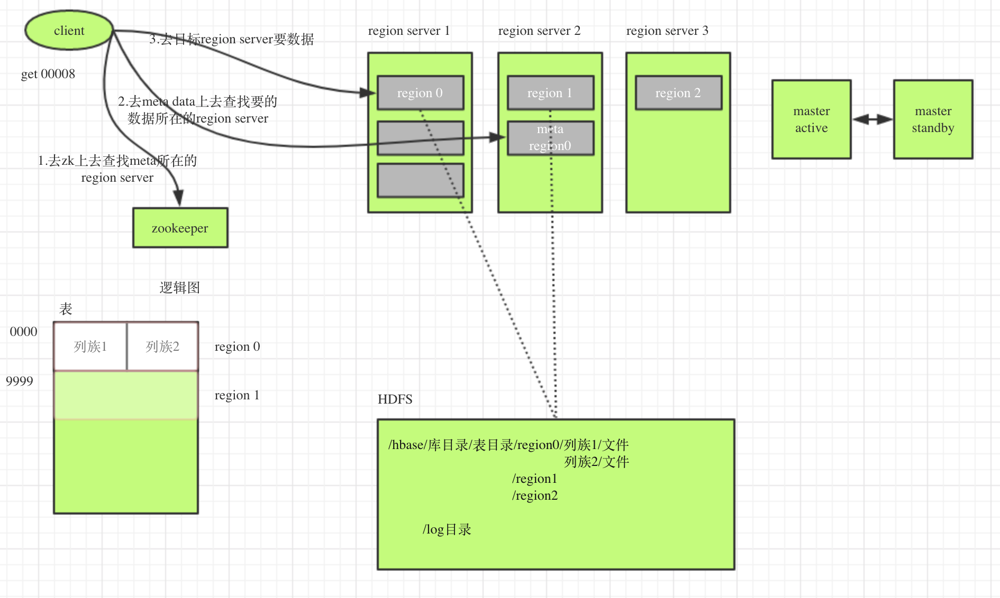

# hbase

HBase – Hadoop Database，是一个高可靠性、高性能、面向列、可伸缩的分布式存储系统，利用HBase技术可在廉价PC Server上搭建起大规模结构化存储集群。

Hbase即分布式的数据库，其底层基于HDFS，提供了随机访问的存储和检索数据的功能。

* HBase有以下几点优势：
    1. 传统的数据库比如mysql，是以行存储的，数据一行一行的存储，如果要读出数据中的某一列，就必须读出一整行的数据，如果每一行的数据非常的大那么则会读出很多不必要的数据。HBase是基于列存储的数据库，每一列的数据是存储在一起的，HBase的列族数量是固定的，但是HBase的列的数量是可以随意增长的，这就意味着如果在存储某行数据的时候需要添加一个新的列，直接指定某列加入到某个列族，然后存入数据就行了，这是因为在HBase里面查找一条指定的数据是通过键值对应来查找的,键为<rowkey,column family,column ,timestamp>,值为数据.
    2. 传统的数据库中，如果某一行的值没有指定一般会指定默认值或者设置为空值，这样会造成存储空间的浪费，而在HBase中，没有值的列就不存储任何值，节省了很多空间。
    3. HBase是可以动态扩展的，如果存储空间不够了，只需要在集群里面添加新的服务器即可，而传统的数据库还需要做很多的额外工作。HBase在某个表行的数量过多的时候会自动拆分成多个Region，而在传统数据库中这些操作只能认为的指定。
    4. HBase更新值并不会立即删除之前的值，所以可以保存多个版本的历史值。

* 但是HBase也有一些缺点:

    1. HBase 写入的时候使用会先将数据写入缓存当中，这样做的效果就是写入一条数据非常的快，但是造成的损失就是读性能降低，因为读数据的时候会在内存和文件系统中同时查找要查询的数据是否存在，然后对查询的结果进行合并，最后的结果将返回给用户。当然HBase提供了一个小的解决方案就是，在RegionServer上设置block cache来缓存用户读取的数据，block cache缓存使用的换入换出算法是LRU，这样能够保证经常读取的数据能保存在内存中比较久。
    2. HBase需要使用很大的内存，所以对gc来说很麻烦。

