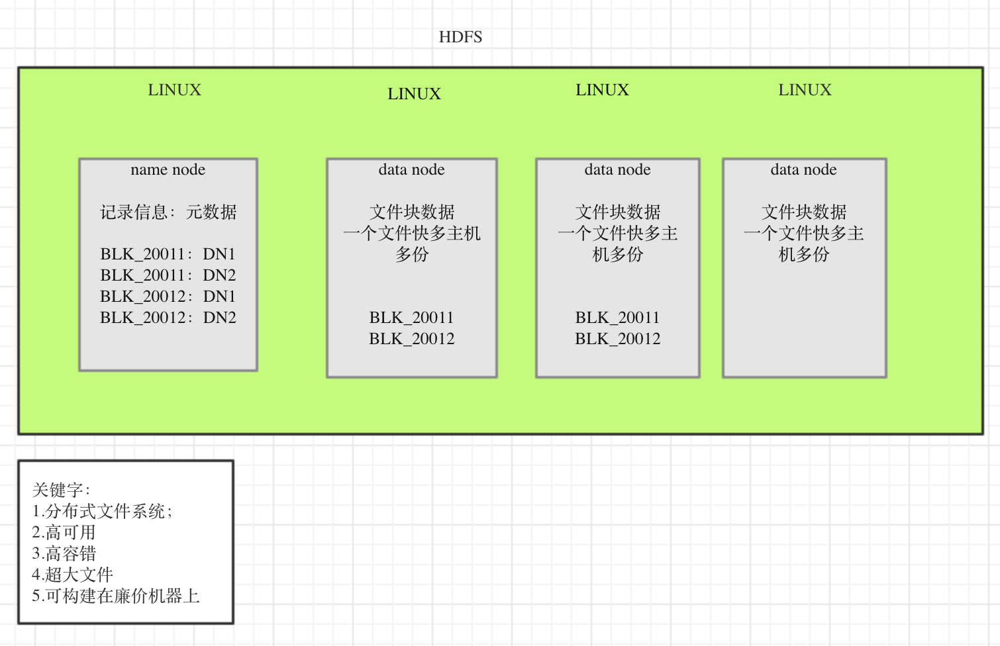

# HDFS

## 什么是hadoop   

hadoop 中有三个核心组件： 
* 分布式文件系统: HDFS -- 实现将文件分布式存储在很多服务器上；
* 分布式运算编程框架： MAPREUDUCE -- 实现在很多机器上分布式并行运算；
* 分布式资源调度平台： YARM -- 帮助用户调度大量的mapreduce程序，并合理的分配运算资源。

## HDFS整体运行机制

* HDFS对用户提供一个统一的目录树
* 存储用户的文件时会分布式的存储到若干个data note服务器上
* 用户的文件块可以存储多个副本
* 用户的文件块的存储位置信息，记录在name node中的内存中，并且会定期的把内存的数据序列号到磁盘上；

