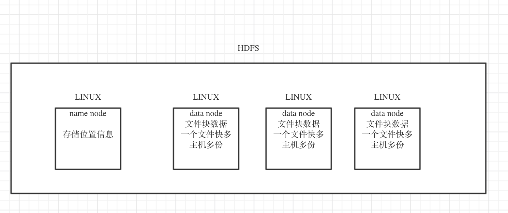

# 大数据基本概念

## 什么是大数据

基本概念

在互联网发展的当今阶段，大量日常、工作等食物产生的数据都已经信息化，人类产生的数据量相对于以前有爆炸性的增长，以前传统的数据处理技术已经无法胜任，需求催生技术，一套用来处理海量数据的工具应运而生，这就是大数据。

* 核心技术：
  * 海量数据存储，分布式；
  * 海量数据运算，分布式；

* 存储框架： 
  * HDFS -- 分布式文件存储系统；(HADOOP中的存储框架)
  * HBASE -- 分布式数据库系统
  * KAFKA -- 分布式消息缓存系统（实时流试处理）
  
* 运算框架：（要解决的核心问题就是帮用户将处理逻辑在很多机器上运行）
  * MAPREDUSE -- 离线批处理/HADOOP中的运算框架
  * SPARK     -- 离线批处理/实时流量计算
  * STORM     -- 实时流计算 

* 辅助工具（解放大数据工程师的一些繁琐工作）：
  * HIVE  -- 数据仓库工具 （不是数据库，可以接收sql，翻译成为mapreduse或者spark程序）
  * FLUME -- 数据采集
  * SQOPP -- 数据迁移
  * elastick search -- 分布式搜索引擎

* 总之大数据是: 
  * 有海量的数据
  * 对海量的数据进行挖掘的需求；
  * 对海量数据进行挖掘的软件工具(hadoop、spark、storm、flink、tez、impala...)

## 大数据在生活中的应用

* 电商系统的商品推荐
* 精准广告推送
* 公司运营情况分析、产品分析

## 什么是hadoop   

hadoop 中有三个核心组件： 
* 分布式文件系统: HDFS -- 实现将文件分布式存储在很多服务器上；
* 分布式运算编程框架： MAPREUDUCE -- 实现在很多机器上分布式并行运算；
* 分布式资源调度平台： YARM -- 帮助用户调度大量的mapreduce程序，并合理的分配运算资源。

## HDFS整体运行机制

* HDFS对用户提供一个统一的目录树
* 存储用户的文件时会分布式的存储到若干个data note服务器上
* 用户的文件块可以存储多个副本
* 用户的文件块的存储位置信息，记录在name node中的内存中，并且会定期的把内存的数据序列号到磁盘上；

