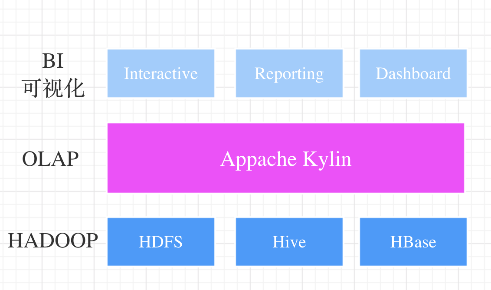
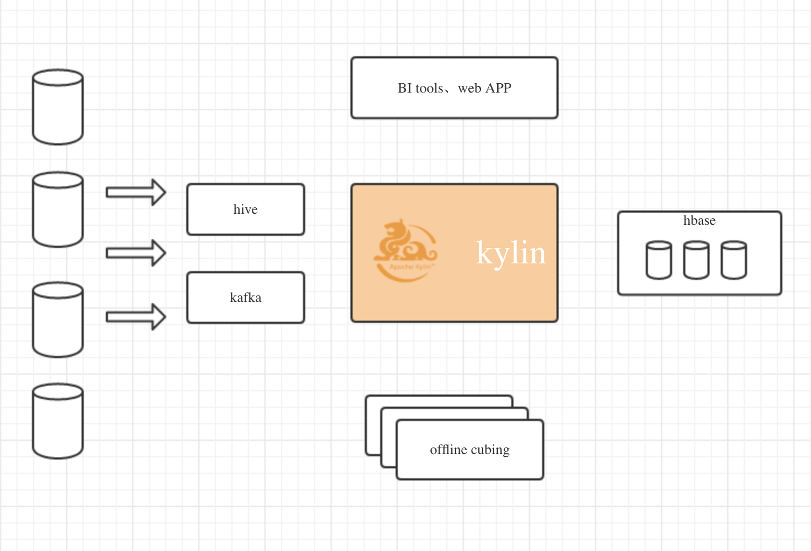
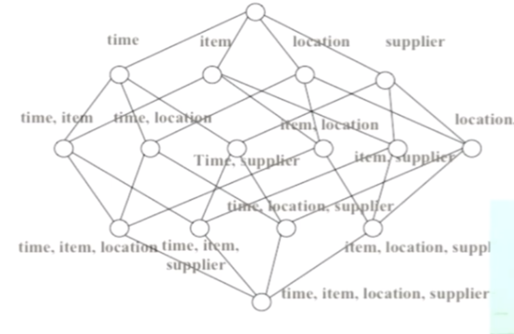
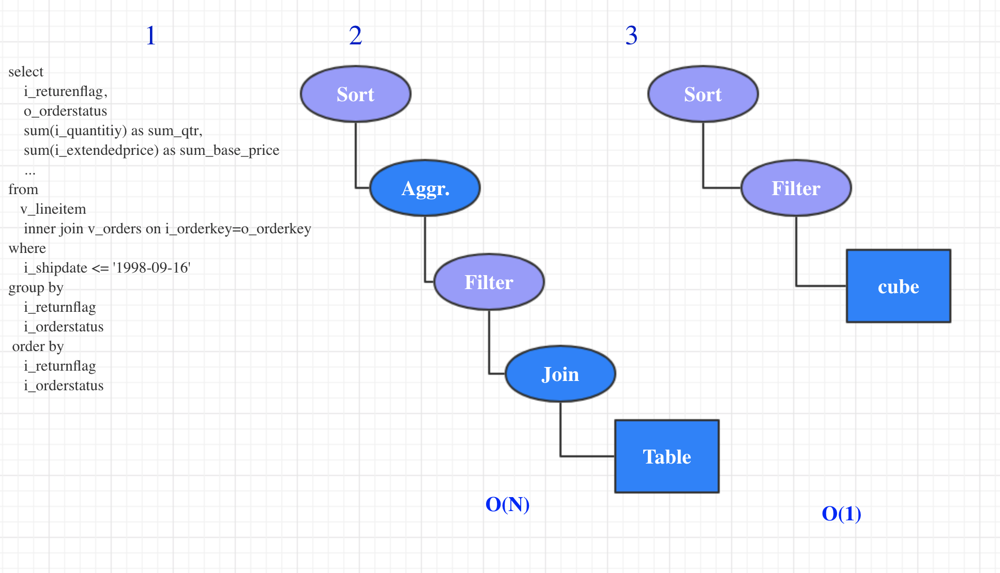

# kylin

## kylin是什么？

Apache Kylin™是一个开源的分布式分析引擎，提供Hadoop之上的SQL查询接口及多维分析（OLAP）能力以支持超大规模数据，最初由eBay Inc.开发并贡献至开源社区。

Kylin的核心思想是预计算，即对多维分析可能用到的度量进行预计算，将计算好的结果保存成Cube，供查询时直接访问。把高复杂度的聚合运算、多表连接等操作转换成对预计算结果的查询，这决定了Kylin能够拥有很好的快速查询和高并发能力。

为了更好的适应大数据环境，Kylin从数据仓库中最常用的Hive中读取源数据，使用 MapReduce作为Cube构建的引擎，并把预计算结果保存在HBase中，对外暴露Rest API/JDBC/ODBC的查询接口。因为Kylin支持标准的ANSI SQL，所以可以和常用分析工具（如Tableau、Excel等）进行无缝对接。下面是Kylin的架构图。

## 目标

* 在千亿级别的数据上做亚秒级别的查询；

## 预计算原理

* 基于cube的理论
* build engine执行构建任务
* query engine在计算结果上完成查询。

## 工作原理举例

## 商用案例

* 今日头头条，最大规模的数据查询，3万亿 -- kylin官方举办的meetup活动，今日头条员工参加透露；
* 太平洋保险60+维度的cube,太平洋保险  -- kylin官方举办的meetup活动，kylin员工透露；

 